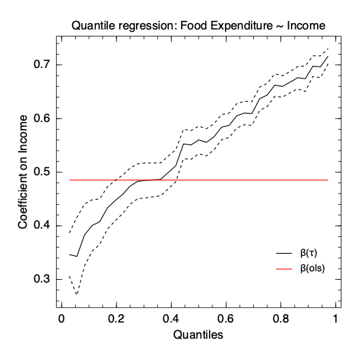

[](https://coveralls.io/r/pkofod/QuantileRegression.jl?branch=master)
[](https://travis-ci.org/pkofod/QuantileRegression.jl)

# Quantile regression in the Julia language

A very simple (and mostly untested) implementation of quantile regression.

* Install using `Pkg.clone(https://github.com/pkofod/QuantileRegression.jl)`
* Main author: Patrick Kofod Mogensen
* Contact: Use the [https://github.com/pkofod/QuantileRegression.jl/issues](issues) page
* License: BSD-3

# Example

The file ``examples/qreg_example.jl`` shows how to use the functions provided here. It replicates part of the analysis in:

* Koenker, Roger and Kevin F. Hallock. "Quantile Regression". Journal of Economic Perspectives, Volume 15, Number 4, Fall 2001, Pages 143–156

We are interested in the relationship between income and expenditures on food for a sample of working class Belgian households in 1857 (the Engel data), so we estimate a least absolute deviation model.

```jlcon
julia> using QuantileRegression

julia> using Requests

julia> # Load data
       url = "http://vincentarelbundock.github.io/Rdatasets/csv/quantreg/engel.csv"
"http://vincentarelbundock.github.io/Rdatasets/csv/quantreg/engel.csv"

julia> df = readtable(Requests.get_streaming(url))
235×3 DataFrames.DataFrame
│ Row │ x   │ income  │ foodexp │
├─────┼─────┼─────────┼─────────┤
│ 1   │ 1   │ 420.158 │ 255.839 │
│ 2   │ 2   │ 541.412 │ 310.959 │
│ 3   │ 3   │ 901.157 │ 485.68  │
│ 4   │ 4   │ 639.08  │ 402.997 │
│ 5   │ 5   │ 750.876 │ 495.561 │
│ 6   │ 6   │ 945.799 │ 633.798 │
│ 7   │ 7   │ 829.398 │ 630.757 │
│ 8   │ 8   │ 979.165 │ 700.441 │
⋮
│ 227 │ 227 │ 776.596 │ 485.52  │
│ 228 │ 228 │ 1230.92 │ 772.761 │
│ 229 │ 229 │ 1807.95 │ 993.963 │
│ 230 │ 230 │ 415.441 │ 305.439 │
│ 231 │ 231 │ 440.517 │ 306.519 │
│ 232 │ 232 │ 541.201 │ 299.199 │
│ 233 │ 233 │ 581.36  │ 468.001 │
│ 234 │ 234 │ 743.077 │ 522.602 │
│ 235 │ 235 │ 1057.68 │ 750.32  │

julia> # Fit least absolute deviation model (quantile  = .5)
       ResultQR = qreg(foodexp~income, df, .5)
DataFrames.DataFrameRegressionModel{QuantileRegression.QRegModel,Array{Float64,2}}

Formula: foodexp ~ 1 + income

Coefficients:
             Estimate Std.Error t value
(Intercept)   81.4822   14.6345 5.56783
income       0.560181 0.0131756 42.5164
```

The results look pretty close to Stata 12's ``qreg``:

    . insheet using engel.csv
    . qreg foodexp income, vce(iid, kernel(epan2))
    Median regression                                    Number of obs =       235
      Raw sum of deviations 46278.06 (about 582.54126)
      Min sum of deviations 17559.93                     Pseudo R2     =    0.6206

    ------------------------------------------------------------------------------
         foodexp |      Coef.   Std. Err.      t    P>|t|     [95% Conf. Interval]
    -------------+----------------------------------------------------------------
          income |   .5601805   .0131763    42.51   0.000     .5342206    .5861403
           _cons |   81.48233   14.63518     5.57   0.000     52.64815    110.3165
    ------------------------------------------------------------------------------

We can also compute and plot (using Julia's Winston) results for various quantiles. Full code to produce the figure is in the examples folder.



# History
This package was originally created as a port of the reweighed least squares code
from the python project [https://github.com/statsmodels/statsmodels](statsmodels)
by Vincent Arel-Bundock. All contributions can be seen via the [https://github.com/pkofod/QuantileRegression.jl/graphs/contributors](contributors) page.
